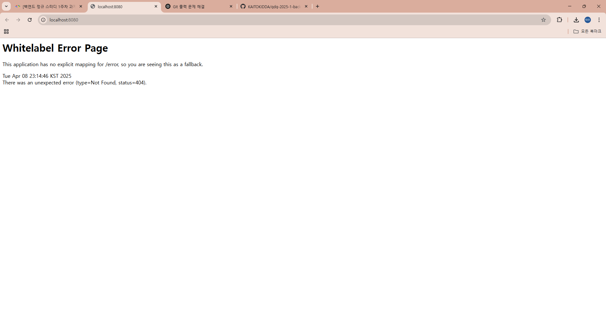

# Week 1 - Weekly I Learned (WIL)

## 📚 1주차 학습 내용 정리

이번 주에는 웹의 기본 개념부터 백엔드 개발의 출발점이 되는 HTTP 통신 구조, 그리고 REST API 설계 원칙까지 학습했습니다.

### 🌐 웹과 클라이언트-서버 모델

- 웹이란, 여러 컴퓨터가 서로 연결되어 정보를 주고받는 공간입니다.
- 일반적으로 웹에서는 클라이언트(예: 웹 브라우저)가 요청을 보내고, 서버가 그 요청을 처리하여 응답하는 **클라이언트-서버 구조**로 동작합니다.
- 예를 들어, 브라우저가 `www.naver.com`에 접속하면, 브라우저는 네이버 서버에 HTML 데이터를 요청하고 서버는 이에 대한 응답을 보냅니다.

### 📮 HTTP 프로토콜

- 컴퓨터끼리 데이터를 주고받기 위해서는 **통신 규약(프로토콜)**이 필요합니다.
- 웹에서는 HTTP(Hypertext Transfer Protocol)를 사용하며, 이때 요청에는 **HTTP Method**와 **URL**이 함께 포함됩니다.
- 주요 HTTP 메서드:
    - `GET`: 데이터 조회
    - `POST`: 데이터 생성
    - `PUT`, `PATCH`: 데이터 수정
        - `PUT`: 전체 리소스를 교체 (전체 데이터를 완전히 덮어씀)
        - `PATCH`: 리소스의 일부만 수정 (필요한 필드만 보냄)
    - `DELETE`: 데이터 삭제
- URL은 데이터를 가리키는 주소이며, `path parameter`나 `query string` 형태로 데이터를 구분하거나 필터링합니다.

예:
- `/user/1` → 사용자 ID 1번의 정보
- `/search?keyword=hello` → 키워드가 hello인 항목 검색

### 🧾 HTTP 요청과 응답 구조

- 요청과 응답은 각각 **HTTP 헤더**와 **HTTP 바디**로 구성됩니다.
- 헤더에는 메서드, URL, 인증 정보 등이 담기고, 바디에는 실제 데이터가 들어갑니다. (보통 JSON 형식 사용)
- 응답 시에는 요청 처리 결과를 나타내는 **HTTP 상태 코드**도 함께 포함됩니다.

주요 상태 코드:
- `200 OK`: 요청 성공
- `201 Created`: 리소스 생성됨
- `400 Bad Request`: 클라이언트 요청 오류
- `404 Not Found`: 리소스를 찾을 수 없음
- `500 Internal Server Error`: 서버 내부 오류

### 🖥 프론트엔드와 백엔드의 역할

- 프론트엔드는 사용자에게 보여지는 화면(UI)을 담당하며, 자주 변하는 콘텐츠는 백엔드로부터 받아옵니다.
- 백엔드는 요청에 따라 데이터를 생성, 조회, 수정, 삭제하며 클라이언트에 응답합니다.
- 프론트와 백엔드는 HTTP 기반의 API를 통해 서로 데이터를 주고받습니다.

### 📌 API와 REST

- API(Application Programming Interface)는 프로그램 간 통신을 위한 창구입니다.
- REST API는 URL로 자원을 명사형으로 표현하고, HTTP Method로 동작을 나타냅니다.
    - 예: `GET /todo/list`, `POST /todo`
- RESTful한 API는 직관적이고 구조적인 API 설계를 도와줍니다.

이번 주차 학습을 통해 **웹의 기본 작동 원리와 백엔드 개발에서 HTTP가 왜 중요한지**, 그리고 **REST API의 설계 철학**까지 폭넓게 이해할 수 있었습니다.

---

## ✍️ TodoMate API 설계

TodoMate의 기능 명세를 참고하여 아래와 같이 API를 설계해보았습니다.  
(*URL은 path만 작성, 공통 도메인 생략*)

### 🧑‍💼 사용자 관련 API
- POST /register  → 회원가입
- POST /login     → 로그인
- POST /logout    → 로그아웃

### ✅ 할 일(Todo) 관련 API
- GET /todo/list                     → 내 할 일 전체 조회
- GET /todo/list?date=2025-04-08    → 특정 날짜의 할 일 조회
- POST /todo                        → 할 일 생성
- PATCH /todo/{todo_id}            → 할 일 수정
- DELETE /todo/{todo_id}           → 할 일 삭제
- POST /todo/{todo_id}/check       → 할 일 체크
- POST /todo/{todo_id}/uncheck     → 할 일 체크 해제

### 👥 친구 관련 API
- GET /friends                      → 내 친구 리스트 조회
- GET /friends/search?nickname=보라 → 닉네임으로 친구 검색
- POST /friends/{nickname}/follow  → 친구 팔로우
- POST /friends/{nickname}/unfollow → 친구 언팔로우
- GET /friends/{nickname}/todo     → 특정 친구의 할 일 조회

---

## 🌐 개발 환경 설정 및 실행

스프링 프로젝트를 생성하고 개발 환경을 설정한 뒤,  
Spring Boot 애플리케이션을 실행해 웹 브라우저에서 `localhost:8080`에 접속했습니다.

아래는 실행 후 흰색 에러 화면의 캡처입니다:

